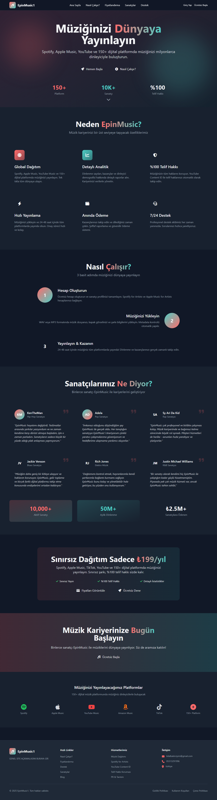

# EpinMusic 🎶

EpinMusic is a modern e-pin and digital music distribution platform built with PHP, MySQL and Bootstrap.  
It allows content creators and music producers to distribute and sell their products securely and efficiently.

---

## 🔧 Technologies Used

- PHP 8.x  
- MySQL  
- Bootstrap 5  
- HTML/CSS/JS  
- mPDF (for invoice generation)  

---

## 🎯 Key Features

- E-pin sale module  
- Music track upload and licensing  
- Payment integration (mocked)  
- Admin panel with user and product control  
- Invoice generation and reporting  
- Simple analytics dashboard  

## About Me

I developed EpinMusic to simplify digital music distribution and e-pin sales for creators.  
I worked on full-stack development including backend, frontend, and payment integration.

---

## 📸 Screenshot

Here is a preview of the EpinMusic dashboard:

